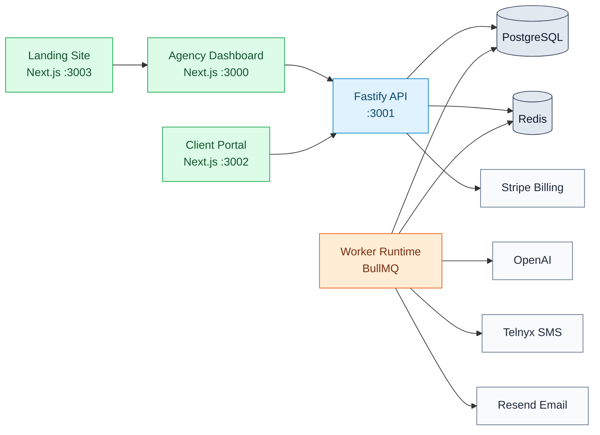
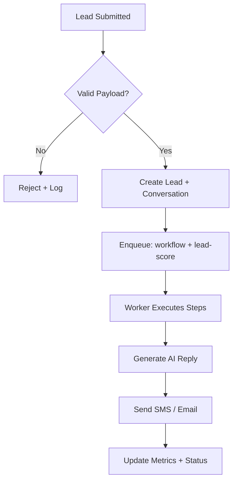
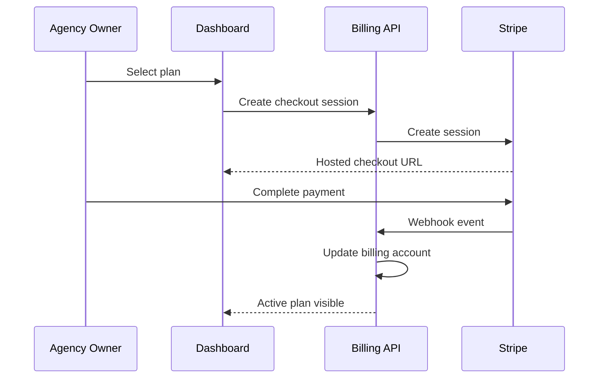

# Ai-Franchise


Production-grade, multi-tenant AI franchise operating system built for agencies and service businesses to capture leads, automate conversations, trigger workflows, book appointments, manage clients, and deploy repeatable white-label automation systems at scale.

## Product Outcome

Ai-Franchise is designed to help agencies and operators deploy repeatable AI-powered client systems that:

- capture inbound leads
- trigger immediate SMS/email follow-up
- qualify prospects automatically
- book appointments
- centralize communication history
- track pipeline movement and client performance
- manage recurring billing and usage
- clone winning templates across many client accounts

The platform is engineered for simplicity, speed, repeatability, and white-label commercialization.

## Product Goals

- Never lose inbound demand: every lead is captured and traceable.
- Respond in minutes or less: immediate AI-assisted first-touch.
- Convert through automation: structured, multi-step follow-up.
- Book outcomes, not activity: appointments and revenue are first-class metrics.
- Scale across tenants: agencies can replicate proven systems across client accounts.
- Preserve operator control: AI accelerates execution, humans own final accountability.

## Table of Contents

1. [Target Users](#target-users)
2. [Golden Path Demo](#golden-path-demo)
3. [Simplicity Rules](#simplicity-rules)
4. [Core Modules](#core-modules)
5. [Data Model and Tenant Safety](#data-model-and-tenant-safety)
6. [Reliability and Security](#reliability-and-security)
7. [System Color Map](#system-color-map)
8. [Engineered Architecture](#engineered-architecture)
9. [Flow Charts](#flow-charts)
10. [Monorepo Layout](#monorepo-layout)
11. [Quick Start](#quick-start)
12. [Service URLs](#service-urls)
13. [GitHub Pages](#github-pages)
14. [Production Notes](#production-notes)
15. [License](#license)

## Target Users

- Agency Owner: configures workspace, client accounts, pricing, and operating standards.
- Operator: runs day-to-day lead handling, inbox management, and workflow operations.
- Client: sees outcomes in the client portal (leads, conversations, appointments, results).
- Super Admin: governs platform-level controls, safety, and multi-tenant operations.

## Golden Path Demo

1. Agency Owner creates organization workspace.
2. Operator onboards first client account.
3. Team connects SMS and email channels.
4. Team installs a template workflow.
5. New lead enters from form, ads, missed call, or inbound SMS.
6. AI sends first response and starts follow-up sequence.
7. Workflow updates lead stage and scores qualification.
8. Appointment gets booked and tracked.
9. Client sees pipeline and conversation outcome in portal.
10. Agency repeats the same winning setup across more client accounts.

## Simplicity Rules

- Guided onboarding over complex setup.
- Template-first workflow deployment over custom-from-scratch logic.
- Plain business language over technical jargon in user surfaces.
- Default flows before custom flows.
- No enterprise clutter in primary operator paths.
- Keep critical actions one or two clicks from the dashboard.

## Core Modules

- CRM: lead capture, status progression, notes, tags, and ownership.
- Communications: SMS/email conversations, threading, and timeline visibility.
- Workflow Engine: trigger/step execution, orchestration, and status transitions.
- AI Orchestration: prompt templates, reply generation, qualification support, escalation.
- Billing: subscriptions, usage tracking, checkout, and portal management.
- White-labeling: organization/client branding and reusable template cloning.
- Client Portal: client-facing visibility into leads, appointments, and activity.
- Admin: tenancy governance, permissions, and operational controls.

## Data Model and Tenant Safety

The data model is intentionally tenant-first and safety-constrained:

- Organizations: top-level tenant boundary.
- Client Accounts: customer-level business units inside an organization.
- Memberships: explicit user-to-organization and user-to-client access links.
- RBAC: role/permission matrix controls all sensitive actions.
- Tenant-aware query boundaries: routes and services must scope by tenant identifiers.
- Audit logging: change history and actor context for traceability.
- Webhook idempotency: external events are deduplicated and safely re-processed.

These constraints are mandatory platform guarantees, not optional conventions.

## Reliability and Security

Operational behavior is designed for platform-grade execution:

- Idempotent webhook handling for Stripe/Telnyx/Resend/OpenAI events.
- Queue-backed async processing for workflow, AI reply, scoring, reminders, and email.
- Retry strategy on transient failures with structured failure states.
- Failure queues/manual intervention path for non-recoverable jobs.
- Human escalation path for low-confidence or high-risk AI outcomes.
- Delivery logs for communication visibility and diagnostics.
- Webhook replay support through persisted event records.
- Tenant isolation in service boundaries and API authorization checks.
- Structured logs and correlation identifiers for incident analysis.
- Audit trails on privileged and data-mutating operations.

## System Color Map

- Blue lane: HTTP/API transport and integration boundaries
- Green lane: User-facing web surfaces (Agency, Client, Landing)
- Orange lane: Async automation and workflow workers
- Slate lane: Persistence and infrastructure (PostgreSQL, Redis, storage)

## Engineered Architecture



## Flow Charts

### Lead Intake to AI Follow-Up



### Billing and Subscription Control



## Monorepo Layout

```text
apps/
   api/       Fastify REST API
   web/       Agency dashboard
   client/    Client portal
   landing/   Marketing site
   worker/    BullMQ workers

packages/
   db/            Prisma schema + seed
   core/          Domain services
   workflows/     Automation runtime
   integrations/  OpenAI/Telnyx/Resend/Stripe adapters
   auth/          RBAC and auth helpers
   ui/            Shared React components
   types/         Shared type contracts
   config/        Environment validation
```

## Quick Start

```bash
pnpm install
cp .env.example .env
docker compose up postgres redis -d
pnpm db:push
pnpm db:seed
pnpm dev
```

## Service URLs

- Agency Dashboard: http://localhost:3000
- API: http://localhost:3001
- Client Portal: http://localhost:3002
- Landing Site: http://localhost:3003

## GitHub Pages

This repo includes a Pages-ready site under `docs/` plus a deployment workflow in `.github/workflows/deploy-pages.yml`.

After first push to `main`, enable Pages in repository settings:

1. Settings -> Pages
2. Source: GitHub Actions
3. Merge/push to `main` to publish automatically

## Production Notes

- Keep secrets in GitHub Actions secrets and `.env` files, never in source control.
- Run `pnpm type-check` and `pnpm build` in CI before deploy.
- Use managed PostgreSQL/Redis in production and configure backups/alerts.
- Use alerting on queue depth, webhook failures, and provider delivery errors.
- Enforce webhook signature checks and replay-safe processing.

## License

Private - All rights reserved.
