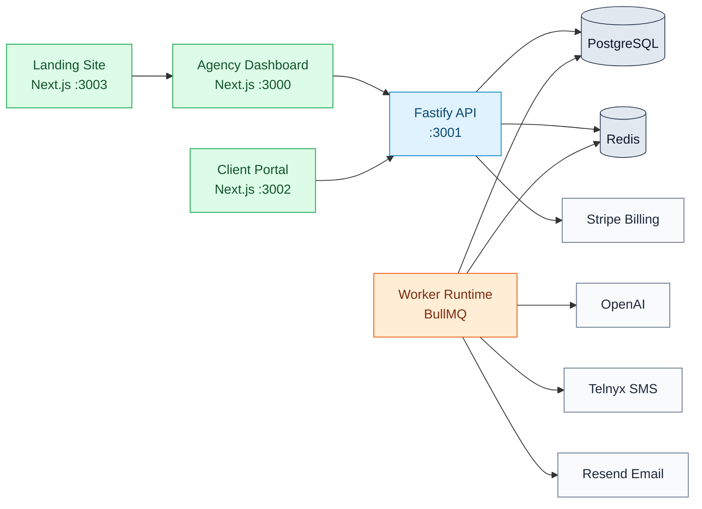
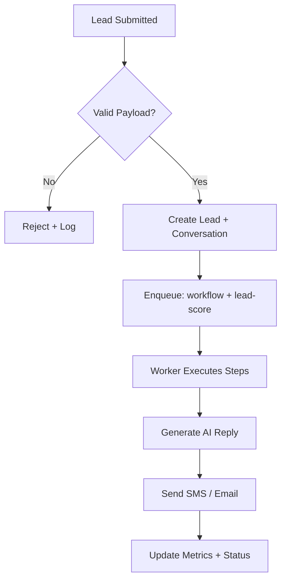
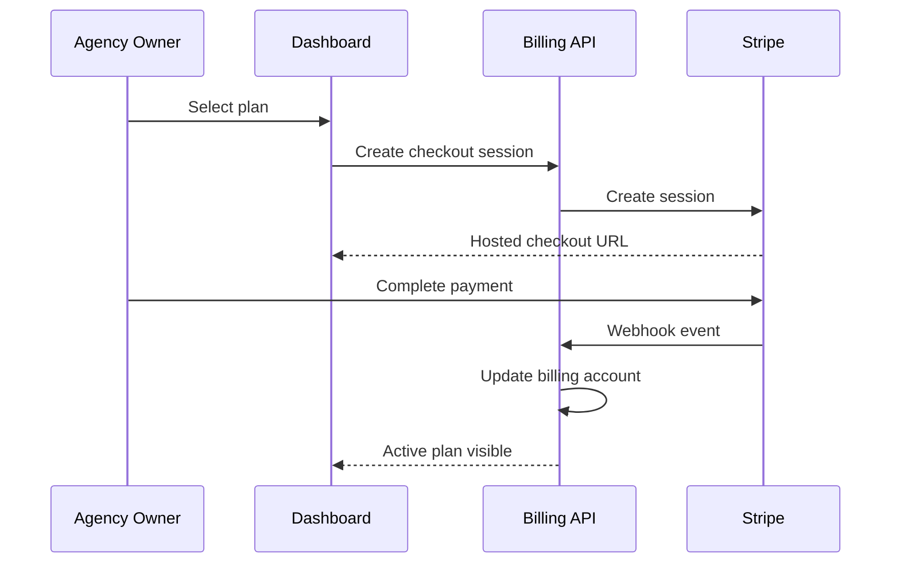

# Ai-Franchise


Production-grade, multi-tenant AI franchise operating system for lead capture, conversational automation, workflow orchestration, and client portal delivery.

## Table of Contents

1. [System Color Map](#system-color-map)
2. [Engineered Architecture](#engineered-architecture)
3. [Flow Charts](#flow-charts)
4. [Monorepo Layout](#monorepo-layout)
5. [Quick Start](#quick-start)
6. [Service URLs](#service-urls)
7. [GitHub Pages](#github-pages)
8. [Production Notes](#production-notes)
9. [License](#license)

## System Color Map

- Blue lane: HTTP/API transport and integration boundaries
- Green lane: User-facing web surfaces (Agency, Client, Landing)
- Orange lane: Async automation and workflow workers
- Slate lane: Persistence and infrastructure (PostgreSQL, Redis, storage)

## Engineered Architecture



## Flow Charts

### Lead Intake to AI Follow-Up



### Billing and Subscription Control



## Monorepo Layout

```text
apps/
   api/       Fastify REST API
   web/       Agency dashboard
   client/    Client portal
   landing/   Marketing site
   worker/    BullMQ workers

packages/
   db/            Prisma schema + seed
   core/          Domain services
   workflows/     Automation runtime
   integrations/  OpenAI/Telnyx/Resend/Stripe adapters
   auth/          RBAC and auth helpers
   ui/            Shared React components
   types/         Shared type contracts
   config/        Environment validation
```

## Quick Start

```bash
pnpm install
cp .env.example .env
docker compose up postgres redis -d
pnpm db:push
pnpm db:seed
pnpm dev
```

## Service URLs

- Agency Dashboard: http://localhost:3000
- API: http://localhost:3001
- Client Portal: http://localhost:3002
- Landing Site: http://localhost:3003

## GitHub Pages

This repo includes a Pages-ready site under `docs/` plus a deployment workflow in `.github/workflows/deploy-pages.yml`.

After first push to `main`, enable Pages in repository settings:

1. Settings -> Pages
2. Source: GitHub Actions
3. Merge/push to `main` to publish automatically

## Production Notes

- Keep secrets in GitHub Actions secrets and `.env` files, never in source control.
- Run `pnpm type-check` and `pnpm build` in CI before deploy.
- Use managed PostgreSQL/Redis in production and configure backups/alerts.

## License

Private - All rights reserved.
