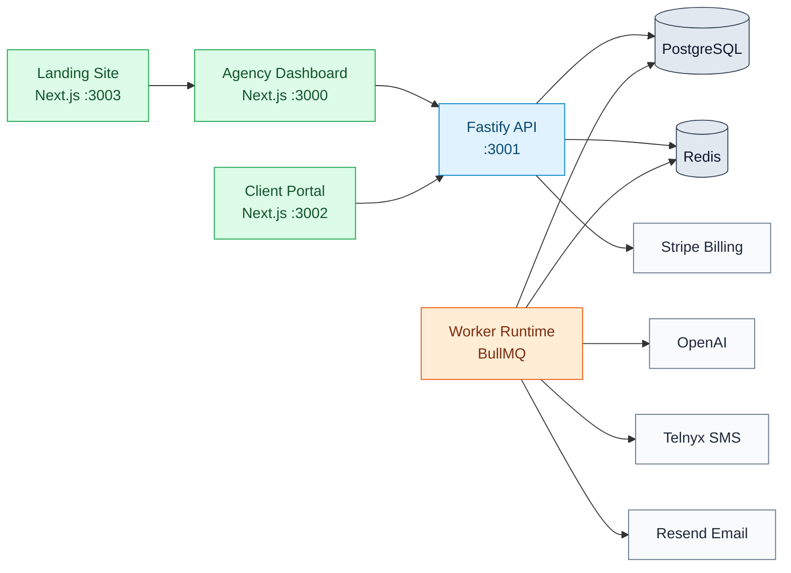
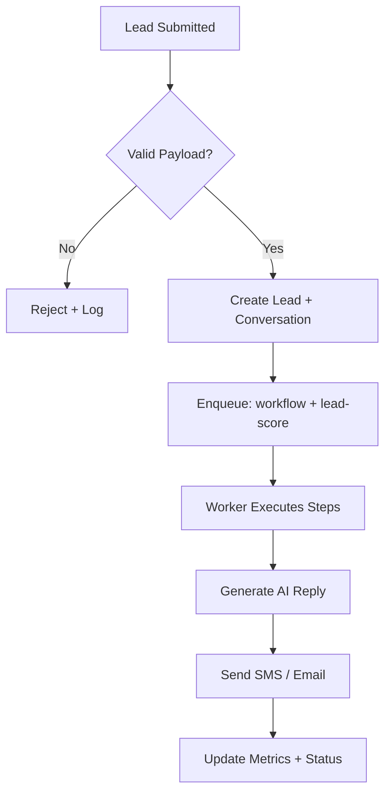
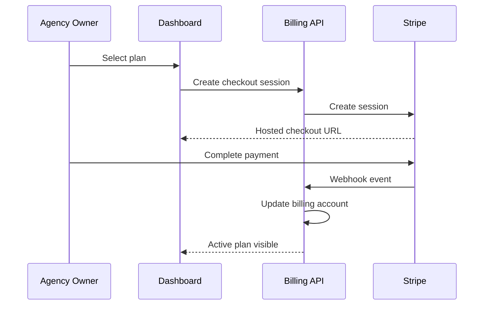

# Ai-Franchise


Production-grade, multi-tenant AI franchise operating system built for agencies and service businesses to capture leads, automate conversations, trigger workflows, book appointments, manage clients, and deploy repeatable white-label automation systems at scale.

## Product Outcome

Ai-Franchise is designed to help agencies and operators deploy repeatable AI-powered client systems that:

- capture inbound leads
- trigger immediate SMS/email follow-up
- qualify prospects automatically
- book appointments
- centralize communication history
- track pipeline movement and client performance
- manage recurring billing and usage
- clone winning templates across many client accounts

The platform is engineered for simplicity, speed, repeatability, and white-label commercialization.

## Table of Contents

1. [Product Goals](#product-goals)
2. [Target Users](#target-users)
3. [Golden Path Demo](#golden-path-demo)
4. [Simplicity Rules](#simplicity-rules)
5. [System Color Map](#system-color-map)
6. [Engineered Architecture](#engineered-architecture)
7. [Flow Charts](#flow-charts)
8. [Core Modules](#core-modules)
9. [Data Model and Tenant Safety](#data-model-and-tenant-safety)
10. [Integrations and Fallback Behavior](#integrations-and-fallback-behavior)
11. [Reliability and Security](#reliability-and-security)
12. [Monorepo Layout](#monorepo-layout)
13. [Quick Start](#quick-start)
14. [Service URLs](#service-urls)
15. [GitHub Pages](#github-pages)
16. [Production Notes](#production-notes)
17. [License](#license)

## Product Goals

- capture every lead that enters the system
- respond instantly with policy-safe AI assistance
- automate follow-up until qualification or booking
- convert pipeline movement into booked revenue
- provide visibility to agencies and clients without friction
- scale the same winning system across many client accounts

## Target Users

- Agency Owner: configures organization, pricing, templates, and client operations
- Operator: runs daily lead handling, escalation, approvals, and campaign tuning
- Client: views leads, conversations, appointments, and outcomes in the client portal
- Super Admin: governs platform-level policies, reliability controls, and tenant safety

## Golden Path Demo

1. Agency Owner creates organization workspace.
2. Agency Owner onboards a new client account.
3. Operator connects SMS and email channels.
4. Operator installs a template-first automation workflow.
5. Lead enters system via form, call, or inbound message.
6. AI follows up instantly and qualifies lead.
7. Workflow books appointment and updates pipeline.
8. Client reviews performance and outcomes in the portal.
9. Agency clones the same setup for the next client account.

## Simplicity Rules

- guided onboarding over complex setup
- template-first workflows before custom workflow design
- plain business language over internal jargon
- no enterprise clutter in core user paths
- default flows first, customization second
- no silent behavior: important actions must be visible in logs and timelines

## System Color Map

- Blue lane: HTTP/API transport and integration boundaries
- Green lane: User-facing web surfaces (Agency, Client, Landing)
- Orange lane: Async automation and workflow workers
- Slate lane: Persistence and infrastructure (PostgreSQL, Redis, storage)

## Engineered Architecture



## Flow Charts

### Lead Intake to AI Follow-Up



### Billing and Subscription Control



## Core Modules

- CRM: lead lifecycle, stage movement, qualification state, account assignment
- Communications: conversation threads, SMS/email send/receive, delivery state
- Workflow Engine: event triggers, step execution, conditional branching, retries
- AI Orchestration: response generation, template prompts, confidence-based escalation
- Billing: subscription state, usage tracking, customer lifecycle events
- White-labeling: branding, tenant-specific settings, reusable workflow templates
- Client Portal: client-safe visibility into leads, appointments, and activity
- Admin: tenant governance, audit review, operational controls

## Data Model and Tenant Safety

Tenant safety is a non-negotiable invariant in this platform:

- Organizations represent top-level agency tenant boundaries.
- Client Accounts isolate each downstream business served by an agency.
- Memberships and RBAC govern who can view or mutate tenant data.
- All data access must be organization-scoped and client-safe by default.
- Audit logging records critical state transitions and administrative actions.
- Webhook idempotency prevents duplicate external event processing.

Primary multi-tenant entities include Organization, ClientAccount, OrganizationMembership, Lead, Conversation, Message, Appointment, Workflow, BillingAccount, UsageLog, and AuditLog.

## Integrations and Fallback Behavior

External providers include OpenAI, Telnyx, Resend, and Stripe. Platform behavior under failure must remain deterministic:

- retries with bounded backoff for transient provider failures
- failure queues for messages/jobs that exceed retry thresholds
- manual intervention path for operators to resolve blocked conversations
- human escalation when AI confidence or policy constraints require it
- delivery logs for outbound communication traceability
- webhook replay support with idempotency checks

This is required platform behavior, not optional enhancement.

## Reliability and Security

- idempotent webhook processing and replay safety
- strict RBAC enforcement across all API routes
- tenant isolation and organization/client-boundary checks
- append-only audit trails for critical operations
- job retries with dead-letter/failure capture strategy
- structured logs with correlation identifiers for tracing
- secrets management via environment and CI secret stores only

## Monorepo Layout

```text
apps/
   api/       Fastify REST API
   web/       Agency dashboard
   client/    Client portal
   landing/   Marketing site
   worker/    BullMQ workers

packages/
   db/            Prisma schema + seed
   core/          Domain services
   workflows/     Automation runtime
   integrations/  OpenAI/Telnyx/Resend/Stripe adapters
   auth/          RBAC and auth helpers
   ui/            Shared React components
   types/         Shared type contracts
   config/        Environment validation
```

## Quick Start

```bash
pnpm install
cp .env.example .env
docker compose up postgres redis -d
pnpm db:push
pnpm db:seed
pnpm dev
```

## Service URLs

- Agency Dashboard: http://localhost:3000
- API: http://localhost:3001
- Client Portal: http://localhost:3002
- Landing Site: http://localhost:3003

## GitHub Pages

This repo includes a Pages-ready site under `docs/` plus a deployment workflow in `.github/workflows/deploy-pages.yml`.

After first push to `main`, enable Pages in repository settings:

1. Settings -> Pages
2. Source: GitHub Actions
3. Merge/push to `main` to publish automatically

## Production Notes

- Keep secrets in GitHub Actions secrets and `.env` files, never in source control.
- Run `pnpm type-check` and `pnpm build` in CI before deploy.
- Use managed PostgreSQL/Redis in production and configure backups/alerts.

## License

Private - All rights reserved.
